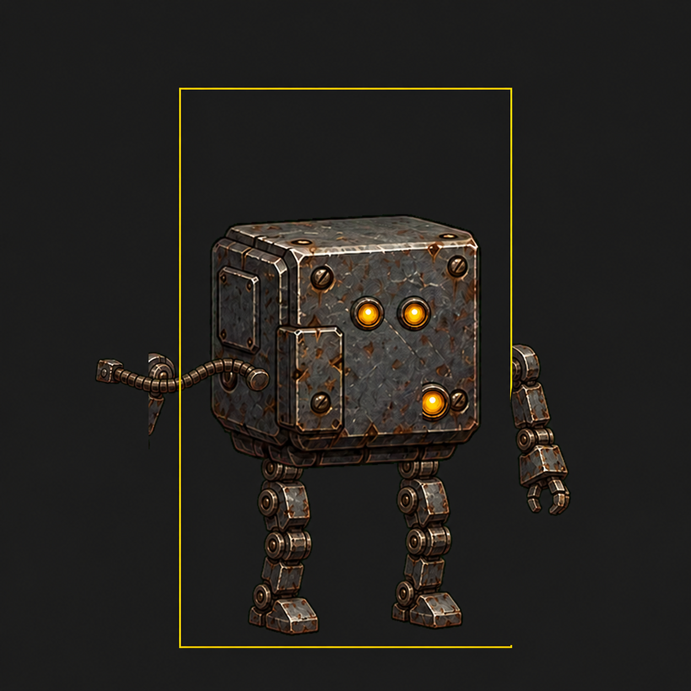

# 废土机械城

一款 Unity 2D 横版动作教学关卡原型。玩家扮演从停摆机械城中醒来的小铁盒机器人，在废弃管廊里学习移动、跳跃、攻击、互动、芯片拾取与机关门机制，并最终进入能源区，寻找记忆核心的第一块碎片。



## 项目概览

- 游戏类型：2D 横版动作 / 平台跳跃 / 教学关卡
- 当前关卡：`Tutorial_01_AwakeningCorridor`
- 主要场景：`Assets/Scenes/Tutorial_01_AwakeningCorridor.unity`
- 目标体验：5-8 分钟内完成完整教学流程
- 美术方向：废土工业管廊、琥珀色能源残响、小型失忆机器人
- 渲染方式：Unity 内置 2D 渲染管线

## 当前玩法内容

- 约 176 Unity units 的横版教学通道。
- 8 个连续区域：苏醒维修台、移动教学、平台跳跃、第一个敌人、机关厅、充电存档点、Boss 维修大厅、机械城入口门。
- 玩家拥有行走、奔跑、跳跃、短按跳跃、土狼时间、跳跃缓冲、普通攻击和互动能力。
- 巡逻维修机器人与「维修站守卫者」作为教学敌人。
- 油坑、断层、电地板回传和玩家死亡会触发约 1.25 秒系统重组复活，返回最近检查点并恢复耐久。
- 电流地板、压缩机和入口锁门用于节奏观察与低压失败反馈。
- 记录点、日志终端、电流地板、电闸、出口门、充电站和补给箱新增精细组件美化：暗钢覆盖件、状态核心、扫描线、危险红灯、青绿安全光和蓝白电弧只做视觉反馈，不改变碰撞和路线。
- 大门、记录点和箭头新增 `*_FXPolish` 特效增强：红灯/红 halo 表示锁定危险，青绿闪烁表示安全/解锁，琥珀扫描用于方向引导，全部无碰撞。
- Boss 入口锁门和 Boss 出口门新增 V20 精细覆盖件：厚重锈铁门框、锁芯、液压夹具、青绿通行槽和门体蒸汽/电弧，只增强视觉，不改变门碰撞和开门逻辑。
- HUD 显示当前目标、耐久、交互提示和剧情/机制提示。
- HUD 已改为废土工业终端界面：目标固定左上安全区，耐久、提示、交互和 Boss 血条使用小字号、暗钢锈铁面板、角部铆钉、琥珀/青绿/红蓝状态灯、机械分段条、轻量扫描线和受击闪烁，确保 1280x720 到 1920x1080 下不越界、不遮挡关键动作。
- 出生点新增约 10 秒电影感叙事片头：先用居中琥珀单色工业启动终端逐行显示 A-07 故障日志，再慢速扫过废弃维修站，最后回到维修台播放更完整的扫描光、暖 halo、蒸汽、火花与主角起身动作；按方向键 / Space / J / E 可跳过。
- Boss 遭遇由 `BossEncounter_StartTrigger` 启动：入口锁闭、顶部 Boss 血条显示、镜头临时收紧；Boss 死亡后入口锁解除并继续让 `Door_BossExit_MechCity` 自动打开。
- 「维修站守卫者」为 14 耐久三阶段教学压轴战：Boss 会根据玩家贴脸贪刀、远距离拖延和频繁跳跃自适应选招；液压冲锤成为主要近中距离攻击，磁钳夹击反制近身贪刀，P2/P3 仍保留小维修机、冲击波、电弧、核心光束、落雷、核心脉冲和终段连携；每招仍只造成 1 点伤害，死亡时破碎、爆火花、散件飞出并在烟雾中消失。
- 两个可读终端用于交代启动日志和芯片说明。
- 背景层包含低雾、尘埃、灯光闪烁、蒸汽、齿轮、电弧、前景剪影和系统可读性美化层。

## 运行环境

- Unity：`2022.3.62f3`
- 平台：已按 Unity 2D 项目结构组织，适合在 Unity Editor 中运行和打包
- 依赖：项目当前只使用 Unity 内置模块，`Packages/manifest.json` 未引入额外第三方包

> 说明：项目文档中记录过 URP 依赖链会触发 `com.unity.ugui` 包编译问题，所以当前工程使用内置 2D 渲染管线保证可运行。玩法脚本和场景结构不依赖 URP，后续可在 Package Manager 修复依赖后再切回 URP 2D Renderer。

## 启动方式

1. 使用 Unity Hub 打开本项目根目录。
2. 确认 Unity 版本为 `2022.3.62f3` 或兼容的 Unity 2022.3 LTS。
3. 打开场景：

   ```text
   Assets/Scenes/Tutorial_01_AwakeningCorridor.unity
   ```

4. 点击 Unity Editor 顶部的 Play 按钮开始试玩。

该场景已经加入 Build Settings：

```text
Assets/Scenes/Tutorial_01_AwakeningCorridor.unity
```

## 操作方式

| 按键 | 功能 |
| --- | --- |
| A / D | 左右移动 |
| Shift + A / D | 奔跑 |
| Space | 跳跃 |
| 短按 Space | 更低的跳跃高度 |
| J | 普通攻击 |
| E | 互动、开门、读取终端、拾取芯片 |

## 关卡流程

1. 出生维修台：玩家先经历 10 秒可跳过的黑屏日志、环境扫镜和维修台苏醒；随后读取启动日志，学习 A / D 移动。
2. 移动通道：通过直线走廊熟悉横向移动和镜头跟随。
3. 跳跃断层：学习 Space 跳跃，掉入油坑后回到安全点。
4. 第一个敌人区：用 J 击败巡逻维修机器人，理解近战攻击范围和敌人接触伤害。
5. 机关机械厅：观察蓝色电流地板与红灯压缩机的节奏。
6. 充电存档点：按 E 充能并记录检查点。
7. Boss 维修大厅：进入后锁门、显示 Boss 血条，练习读液压冲锤、砸地、磁钳夹击、稀有横扫、冲击波、过载电弧、核心光束、落雷和终段连携，并在收招时反击。
8. 机械城入口门：Boss 死亡后出口门自动开启，教学段完成。

## 项目结构

```text
Assets/
  Art/
    Generated/                 # 生成美术资源
    Provided/                  # 手工或外部提供的环境组件
    Reference/                 # 参考图
  Data/
    RepairChip.asset           # 修复芯片配置
  Docs/
    Tutorial_01_Readme.md      # 教学关卡实现说明
    Tutorial_01_LevelDesign.md # 教学关卡设计文档
    Generated_Art_Manifest.md  # 生成美术资源清单
  Scenes/
    Tutorial_01_AwakeningCorridor.unity
  Scripts/
    Runtime/                   # 运行时玩法脚本
    Editor/                    # 场景构建与校验工具
Packages/
  manifest.json
ProjectSettings/
  ProjectVersion.txt
```

## 关键脚本

| 脚本 | 作用 |
| --- | --- |
| `PlayerController2D.cs` | 玩家移动、跳跃、攻击、互动、检查点复活 |
| `PlayerSpawnIntro2D.cs` | 开头叙事片头、出生维修台苏醒、输入锁定、跳过和临时镜头聚焦 |
| `PlayerRespawnCinematic2D.cs` | 检查点复活电影感重组、输入锁定和临时镜头聚焦 |
| `Health.cs` | 生命值、受击、治疗、死亡事件 |
| `PlayerChipInventory.cs` | 芯片装备与击杀回血逻辑 |
| `ChipPickup.cs` | 修复芯片拾取交互 |
| `DoorLock.cs` | 手动门、芯片门、敌人清场门 |
| `EnemyPatrol2D.cs` | 敌人巡逻与接触伤害 |
| `HazardRespawn2D.cs` | 油坑/断层复活触发 |
| `LoreTerminal.cs` | 可读终端交互 |
| `BossEncounterController2D.cs` | Boss 厅触发、入口锁、Boss 血条和临时镜头边界 |
| `RepairStationBoss2D.cs` | 维修站守卫者自适应状态机、阶段、召唤、方向化 hitbox、液压冲锤、磁钳夹击和过载技能 |
| `BossDamageHitbox2D.cs` | Boss 招式伤害转发 |
| `DamageableHurtbox2D.cs` | 独立可受击 hurtbox，避免 Boss 招式伤害盒被玩家误伤 |
| `LevelObjectiveUI.cs` | 目标、耐久、Boss 血条、提示文本 HUD |
| `CameraFollow2D.cs` | 横版相机跟随与 Boss 临时边界 |
| `PlayerRobotVisualAnimator2D.cs` | 主角部件动画 |

## 美术资源

- V6 连续背景切片：`Assets/Art/Generated/Backgrounds/V6/`
- V3 主角部件：`Assets/Art/Generated/Characters/PlayerRobot/V3/`
- V2 高清工业装饰：`Assets/Art/Generated/Environment/V2/`
- 生成源图：`Assets/Art/Generated/Source/`
- 美术资源说明：`Assets/Docs/Generated_Art_Manifest.md`
- 道路视觉仍使用现有 V8/V10 资源，仅通过更细琥珀边线、低透明磨损和更清楚的侧面阴影做小幅精修。
- 系统美化层：`BG_SystemPolish_Readability` 复用现有特效资源，统一路线暗带、区域地标、危险颜色和交互物柔光。
- 动态美化层：`BG_DynamicPolish_V16` 复用现有 dust/halo/steam/spark/electric/scan/fan/chain 资源，按 8 个区域补充清晰增强动态，不新增碰撞或 PNG。
- 出生点开场层：`SpawnIntro_AwakeningPolish` 复用 Effects/V2/V5 特效，负责 10 秒可跳过居中琥珀单色故障日志、慢速环境扫镜、维修台暖光、扫描光、低雾、火花、蒸汽、短动画维修臂、少量蓝白电弧和台体微震。
- 出生维修台本体：`AwakeningBench_RefinedAssembly` 使用 `Environment/V12/spawn_repair_bed_refined.png`，`AwakeningBench_TablePolish` 只补台体内部磨损、铆钉、油污、底部暖光、线缆、扫描线和状态灯，不改变道路和碰撞。
- 组件精细化覆盖件：`Assets/Art/Generated/Environment/V19/` 包含终端屏幕、控制/门锁板和状态核心三张透明 PNG，由 `*_PolishRefined` 视觉节点复用。
- 组件特效增强：`*_FXPolish` 复用 Effects/V2/V5 与 Environment/V7 素材，为 Boss 入口锁、出口门、记录点和箭头提供低侵入状态灯、扫描线、halo 和火花。
- Boss 门精细覆盖件：`Assets/Art/Generated/Environment/V20/` 包含入口锁门和出口门两张透明 PNG，仅用于 Boss 战门体美术层。
- Boss 精细覆盖件：V3 外甲 `Assets/Art/Generated/Enemies/V3/bossv3_guardian_refined_overlay.png` 叠加在原 V2 Boss 身体上；V4 暴走层 `Assets/Art/Generated/Enemies/V4/bossv4_guardian_overload_overlay.png` 只在 P3、受击高亮和死亡演出中显现；V5 多部件层 `Assets/Art/Generated/Enemies/V5/` 提供核心、肩甲、磁钳、管线和裂纹层，由 Boss 状态机驱动液压冲锤、磁钳夹击、受击和暴走反馈。技能特效与死亡碎片继续复用现有 Effects/V2/V5 和 Environment/V7/V10。
- 跳跃路段背景层：`JumpRoute_BackgroundPolish_BrokenPlatforms` 复用机械墙、破窗、支架、halo、油雾、蒸汽、电弧、扫描光和高处链条，强化截图位置的平台后景和右侧跳跃路线。
- 复活美化层：`RespawnPolish_Runtime` 和 `RespawnPoint_Polish_*` 复用 halo、scan、steam、spark、dust 素材，负责失败点闪烁、检查点重组和检查点激活脉冲。

## 编辑器工具

Unity 菜单中提供了两个项目工具：

```text
Tools/Wasteland Mech City/Build Tutorial Scene
```

用于重新生成教学场景。

```text
Tools/Wasteland Mech City/Validate Tutorial Scene
```

用于检查关键对象是否完整。

## 开发备注

- 当前 README 面向项目打开、试玩和二次开发说明。
- 更细的关卡节奏、数值和美术布局请参考 `Assets/Docs/Tutorial_01_LevelDesign.md`。
- 若需要共享或提交到版本库，通常建议纳管 `Assets/`、`Packages/`、`ProjectSettings/`，并忽略 Unity 自动生成的 `Library/`、`Logs/`、`Temp/`、`Obj/`、`Build/`、`UserSettings/` 等目录。
